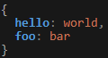

<div align="center">
	<h1 style="margin: 0 1em">Better-Console-Utilities</h1>
	<p>
		This node.js module provides a better way of handling the build-in console for node.js.<br>
		It adds custom colors with auto colorization and custom color tags.
	</p>
	<a href="https://github.com/CTN-Originals/Better-Console-Utilities" title="Github Repository">
		
	</a>
	<a href="https://www.npmjs.com/package/better-console-utilities" title="npm Package Version">
		
	</a>
	<a href="https://github.com/CTN-Originals/Better-Console-Utilities/blob/main/LICENSE" title="License of this project">
		
	</a>
	<br>
	<a href="https://discord.gg/GCBSm4B" title="Project author Disc[Title](README.md)ord Community">
		
	</a>
	<a href="https://www.twitch.tv/ctnoriginals" title="Twitch Channel">
		
	</a>
	
</div>

---

## How to install
You can install this module through npm:
```bash
npm install better-console-utilities
```

## How to use
```javascript
const betterConsole = require("better-console-utilities");
```
This is all you need to do to use this module. The module is now loaded into a variable and you can access all of the functions and variables within it.

#### Creating a new console
```javascript
const { ConsoleInstance } = require("better-console-utilities");
const myConsole = new ConsoleInstance();
```
This creates a new console object.

#### Using the console
```javascript
myConsole.log("Hello World!");
```
>Hello World!

```javascript
const myConsole = new betterConsole.ConsoleInstance();
myConsole.log({hello: "world", foo: "bar"});
```

This prints the object in a JSON format. This also works with arrays and other type of collections.
The colerisation that you see is the "defaultThemeProfile" applied to the console instance if none is specified.

---

#### Theme and Color objects
To customize the looks of any console instance you can use theme and color objects. These objects are the building blocks of the themes and colors that are used in the console. You can customize them to fit your needs.
```javascript
// Slight heads up, these two variable names could conflict with other variables that either you or other packages have defined.
//If this is the case, you can use require("better-console-utilities") and then access these variables by using betterConsoleUtilities.Theme and betterConsoleUtilities.Color
const { Theme, Color } = require("better-console-utilities"); 
const foreground1 = new Color('white') // Color name
const background1 = new Color('#181818') // Hex color
const foreground2 = new Color(0, 180, 255) // RGB color
const background2 = new Color({R: 40, G: 84, B: 124}) // RGB object

const theme1 = new Theme(foreground1, background1, 'bold') // Bold is a text style
const theme2 = new Theme(foreground2, background2, ['italic', 'underline']) // Multiple styles can be applied to one theme as an array
```

---

### Theme Profile
You can reference the default color profile by requiring it:
```javascript
const { defaultThemeProfile } = require("better-console-utilities");
const myTheme = defaultThemeProfile.clone(); // Clones the default theme profile
```
You can also create a new theme profile from scratch:
```javascript
const { ThemeProfile } = require("better-console-utilities");
const myNewTheme = new ThemeProfile(); // Creates a new theme profile with default values (mostly just white as the default color)
```

---

### More Documentation Coming Soon
...