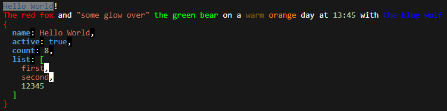

<div align="center">
  <h1 style="margin: 0 1em">Better-Console-Utilities</h1>
  <p>
    This node.js module provides a better way of handling the build-in console for node.js.<br>
    It adds custom colors with auto colorization and custom color tags.
  </p>
  <a href="https://github.com/CTN-Originals/Better-Console-Utilities" title="Github Repository">
    
  </a>
  <a href="https://www.npmjs.com/package/better-console-utilities" title="npm Package Version">
    
  </a>
  <a href="https://github.com/CTN-Originals/Better-Console-Utilities/blob/base/LICENSE" title="License of this project">
    
  </a>
  <br>
  <a href="https://discord.gg/GCBSm4B" title="Discord Community Server Invite">
    
  </a>
  <a href="https://www.twitch.tv/ctnoriginals" title="Twitch Channel">
    
  </a>
</div>

---

## How to install
You can install this module through npm:
```bash
npm install better-console-utilities
```

## How to use
```javascript
const betterConsole = require("better-console-utilities");
```
This is all you need to do to use this module. The module is now loaded into a variable and you can access all of the functions and variables within it.

#### Creating a new console
```javascript
const { ConsoleInstance } = require("better-console-utilities");
const myConsole = new ConsoleInstance();
```
This creates a new console object.

#### Using the console
```javascript
myConsole.log("Hello World!");
```
>Hello World!

```javascript
const myConsole = new betterConsole.ConsoleInstance();
myConsole.log({hello: "world", foo: "bar"});
```
 <br>
This prints the object in a JSON format. This also works with arrays and other type of collections.
The colerisation that you see is the "defaultThemeProfile" applied to the console instance if none is specified.

---

### Theme and Color objects
To customize the looks of any console instance you can use theme and color objects. These objects are the building blocks of the themes and colors that are used in the console. You can customize them to fit your needs.
```javascript
// Slight heads up, these two variable names could conflict with other variables that either you or other packages have defined.
//If this is the case, you can use require("better-console-utilities") and then access these variables by using betterConsoleUtilities.Theme and betterConsoleUtilities.Color
const { Theme, Color } = require("better-console-utilities"); 
const foreground1 = new Color('white') // Color name
const background1 = new Color('#181818') // Hex color
const foreground2 = new Color(0, 180, 255) // RGB color
const background2 = new Color({R: 40, G: 84, B: 124}) // RGB object

const theme1 = new Theme(foreground1, background1, 'bold') // Bold is a text style
const theme2 = new Theme(foreground2, background2, ['italic', 'underline']) // Multiple styles can be applied to one theme as an array
const theme3 = new Theme('red', background1.seturate(1.5)) // A Themeobject also takes in color names and hex colors as strings and will convert them to Color objects automatically
```
if any color parameter is omitted, it will create a color object with all values set to -1. This will cause any color function to not apply any color to the output.

---

## Theme Profile
You can reference the default color profile by requiring it:
```javascript
const { defaultThemeProfile } = require("better-console-utilities");
const myTheme = defaultThemeProfile.clone(); // Clones the default theme profile (Recommended)
```
You can also create a new theme profile from scratch:
```javascript
const { ThemeProfile } = require("better-console-utilities");
const myNewTheme = new ThemeProfile(); // Creates a new theme profile with default values (just white as the default color)
```

#### Creating your own theme profile
```javascript
const { ThemeProfile, Theme, ThemeOverride, ConsoleInstance } = require("better-console-utilities");
const myCustomTheme = new ThemeProfile({
  default: new Theme('#ffffff'), // This is the default theme used for the console instance to fall back to.
  typeThemes: {
    string: { default: new Theme('#C4785B') }, // This is the theme used for strings
    number: { default: new Theme('#B5CEA8') }, // This is the theme used for numbers
    boolean: { default: new Theme('#569CD6') }, // This is the theme used for booleans
    object: {
      default: new Theme('#9CDCFE'), // The default theme for objects
      key: new Theme('#569CD6', null, 'bold'), // The theme for object keys
      value: new Theme('#9CDCFE'), // The theme for object values (will be overwritten with the theme for the type of the value)
      brackets: new Theme('#aaaaaa'), // The theme for the brackets
      punctuation: new Theme('#808080'), // The theme for the punctuation
    },
    array: {
      default: new Theme('#9CDCFE'), // The default theme for arrays
      value: new Theme('#9CDCFE'), // The theme for array values (will be overwritten with the theme for the type of the value)
      brackets: new Theme('#aaaaaa'), // The theme for the brackets
      punctuation: new Theme('#808080'), // The theme for the punctuation
    }
  },
  colorSyntax: [ // This is the array that contains the regular expressions that are used to find the color tags
    /(?<flag>\[(?<fg>fg=(?<ftag>.+?)\s?)?(?<bg>bg=(?<btag>.+?)\s?)?(?<st>st=(?<stag>.+?)\s?)?\])(?<target>\[\/>\]|.*?)(?<end>\[\/>\])/g,
  ],
  overrides: [ // This is the array that hold the overrides for any match in the output (does not apply to collection objects)
    new ThemeOverride([/(?<!\\)(['"`])(?:\\\1|.)*?(\1)/g], new Theme('#C4785B')), // This is an example to override the theme any string that is found in the output (for this example, only string inside of single, double and back quotes)
    new ThemeOverride(/[0-9]+/g, new Theme('#B5CEA8')), // This is an example to override the theme any number that is found in the output (for this example, only numbers that are made up of digits 0-9)
    new ThemeOverride([/ERROR/g, /danger/gi], new Theme('#be0000', null, ['bold', 'flash', 'underscore'])), // Theme override objects also accept an array of regular expressions
    new ThemeOverride('Hello World', new Theme(null, null, ['blink', 'invert'])) // Theme override objects also accepts a string as a target
  ]
});

// Use the theme profile
const myConsole = new ConsoleInstance(myCustomTheme); // Apply the theme to a new console instance

myConsole.log('Hello World!');
myConsole.log('[fg=red]The red fox[/>] and "some glow over" [fg=00FF00]the green bear[/>] on a [fg=ffaa00 st=blink]warm[/>] [fg=ff8800]orange[/>] day at 13:45 with [fg=blue]the blue wolf[/>]');
myConsole.log({
  name: 'Hello World',
  active: true,
  count: 8,
  list: [
    'first',
    'second',
    12345,
  ],
});
```
